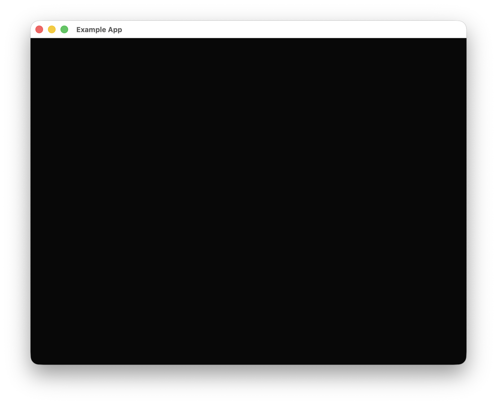

Having a page and running its render loop is a crucial yet easily overlooked part of `Rust Constructor`, because all update logic is placed in page loading.

# Using Pages

In `Rust Constructor`, a page is also a resource called `PageData`, one of the simpler resources in this project. You only need to pay attention to a field called `forced_update`, which, when enabled, forces the page to redraw every frame. If it's not enabled, the interface will stop rendering when the user performs no actions (such as mouse movement or keyboard input), making the screen appear frozen until the user interacts again.

To add a page, simply use the previously mentioned `add_resource`.

To use a page, you just need to call `use_resource`. For the program to function properly, using pages is essential.

# Simple Example

Here is a simple example that applies a page:
```rust
pub struct RcApp {
    pub inner: rust_constructor::app::App,
}

fn main() {
    eframe::run_native(
        "Example App",
        eframe::NativeOptions::default(),
        Box::new(|_| {
            Ok(Box::new(RcApp {
                inner: rust_constructor::app::App::default().current_page("Launch"),
            }))
        }),
    )
    .unwrap();
}

impl eframe::App for RcApp {
    fn ui(&mut self, ui: &mut eframe::egui::Ui, _frame: &mut eframe::Frame) {
        if self
            .inner
            .check_resource_exists(&rust_constructor::build_id("Launch", "PageData"))
            .is_none()
        {
            self.inner
                .add_resource(
                    "Launch",
                    rust_constructor::background::PageData::default().forced_update(true),
                )
                .unwrap();
        };
        match &*self.inner.current_page.clone() {
            "Launch" => self
                .inner
                .use_resource(&rust_constructor::build_id("Launch", "PageData"), None, ui)
                .unwrap(),
            _ => {}
        };
    }
}
```
Note that if you need a custom initial page name, you must specify it when creating the `App`. Also, `build_id` in the code is a helper method for quickly constructing a `RustConstructorId`.

The result looks roughly like this:



Great, you've now basically mastered how to use `Rust Constructor`. Next, let's take a closer look at what each resource does.
