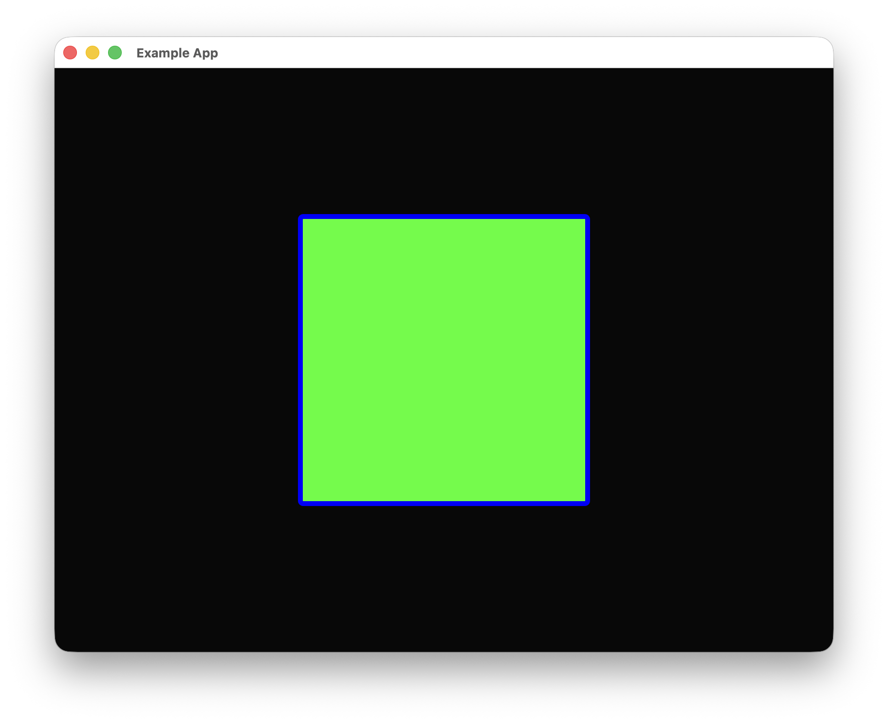

Basic frontend resources are generally straightforward and can fully leverage the power of `Rust Constructor`.

# Image

`Image` can be used to display images and add various overlay layers.

## Code Example

Here's an example of loading the `Rust Constructor` icon:


```rust
self.inner
    .quick_place(
        "Example",
        rust_constructor::basic_front::Image::default()
            .basic_front_resource_config(
                &rust_constructor::BasicFrontResourceConfig::default()
                    .position_size_config(
                        rust_constructor::PositionSizeConfig::default()
                            .origin_size(300_f32, 300_f32)
                            .x_location_grid(1_f32, 2_f32)
                            .y_location_grid(1_f32, 2_f32)
                            .display_method(
                                rust_constructor::HorizontalAlign::Center,
                                rust_constructor::VerticalAlign::Center,
                            ),
                    ),
            )
            .image_load_method(
                &rust_constructor::basic_front::ImageLoadMethod::ByPath((
                    "logo.png".to_string(),
                    [false, false],
                )),
            ),
        None,
        ui,
    )
    .unwrap();
```
This shows the complete process of invoking a resource. `basic_front_resource_config` is a field that every basic frontend resource has, which contains `PositionSizeConfig`, a struct used to control the resource's display position, size, alignment, and other aspects. In this code, `origin_size` controls the image size, and `x_location_grid` and `y_location_grid` use grid-based positioning—specifically, dividing the width or height by the second number and then multiplying by the first number to get the position. In this example, we position the image at the center of the window. `display_method` controls which point of the image the coordinates correspond to in both horizontal and vertical directions, defaulting to the top-left corner of the image. Here we manually set it to the center of the image.

`image_load_method` has two modes: loading by path and loading by texture. The two booleans at the bottom control whether to flip the image horizontally and vertically, respectively.

The result looks roughly like this:


In newer versions of `Rust Constructor`, image loading is multithreaded, so if the loaded image is large, you may need to wait a while before seeing it appear on the page.

# Text

`Text` can be used to display text and supports various text operations.

## Code Example

```rust
self.inner
    .quick_place(
        "Example",
        rust_constructor::basic_front::Text::default()
            .basic_front_resource_config(
                &rust_constructor::BasicFrontResourceConfig::default()
                    .position_size_config(
                        rust_constructor::PositionSizeConfig::default()
                            .origin_size(300_f32, 100_f32)
                            .x_location_grid(1_f32, 2_f32)
                            .y_location_grid(1_f32, 2_f32)
                            .display_method(
                                rust_constructor::HorizontalAlign::Center,
                                rust_constructor::VerticalAlign::Center,
                            ),
                    ),
            )
            .content("Hello world")
            .background_rounding(10_f32)
            .background_color(255, 0, 0)
            .background_alpha(255)
            .font_size(50_f32)
            .color(0, 255, 0),
        None,
        ui,
    )
    .unwrap();
```

The result looks roughly like this:


# Custom Rectangle

`CustomRect` can create a highly customizable rectangle in the `Rust Constructor` style.

## Code Example

```rust
self.inner
    .quick_place(
        "Example",
        rust_constructor::basic_front::CustomRect::default()
            .basic_front_resource_config(
                &rust_constructor::BasicFrontResourceConfig::default()
                    .position_size_config(
                        rust_constructor::PositionSizeConfig::default()
                            .origin_size(300_f32, 300_f32)
                            .x_location_grid(1_f32, 2_f32)
                            .y_location_grid(1_f32, 2_f32)
                            .display_method(
                                rust_constructor::HorizontalAlign::Center,
                                rust_constructor::VerticalAlign::Center,
                            ),
                    ),
            )
            .border_width(5_f32)
            .border_color(0, 0, 255)
            .rounding(5_f32)
            .color(0, 255, 0),
        None,
        ui,
    )
    .unwrap();
```

The result looks roughly like this:


