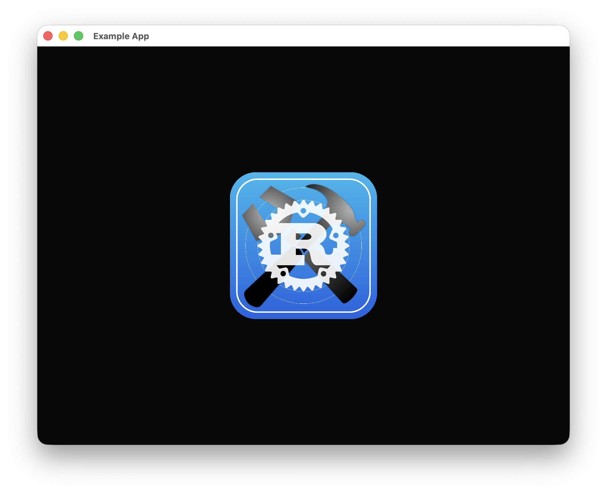
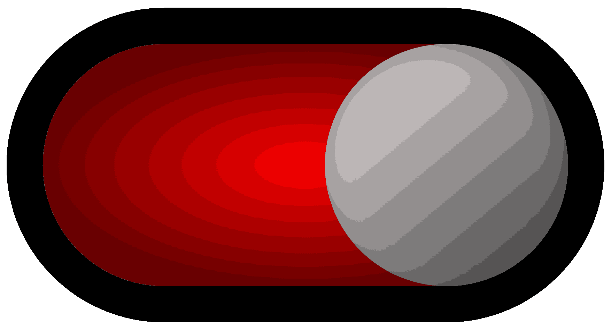

高级前端资源是`Rust Constructor`最鲜明的特色。

# 背景

`Background`是一个实用的资源，他负责整合`Image`和`CustomRect`资源，这样一来，你就可以在需要区域填充时自由选择使用图片还是矩形了。

## 代码示例（矩形）

```rust
self.inner
    .quick_place(
        "Example",
        rust_constructor::advance_front::Background::default().background_type(
            &rust_constructor::advance_front::BackgroundType::CustomRect(
                rust_constructor::basic_front::CustomRectConfig::default()
                    .position_size_config(Some(
                        rust_constructor::PositionSizeConfig::default()
                            .origin_size(300_f32, 300_f32)
                            .x_location_grid(1_f32, 2_f32)
                            .y_location_grid(1_f32, 2_f32)
                            .display_method(
                                rust_constructor::HorizontalAlign::Center,
                                rust_constructor::VerticalAlign::Center,
                            ),
                    ))
                    .border_width(Some(5_f32))
                    .border_color(Some([0, 0, 255]))
                    .rounding(Some(5_f32))
                    .color(Some([0, 255, 0])),
            ),
        ),
        None,
        ui,
    )
    .unwrap();
```

此处涉及到另一个关键概念：配置。每一个前端资源都拥有一个与之对应的配置结构体，它们的作用是快速设置好一个资源的各项信息，并且每一个字段都是选填。在这段代码中，我们将背景设置为矩形，并且提供了一个矩形配置。


## 代码示例（图片）

```rust
self.inner
    .quick_place(
        "Example",
        rust_constructor::advance_front::Background::default().background_type(
            &rust_constructor::advance_front::BackgroundType::Image(
                rust_constructor::basic_front::ImageConfig::default()
                    .position_size_config(Some(
                        rust_constructor::PositionSizeConfig::default()
                            .origin_size(300_f32, 300_f32)
                            .x_location_grid(1_f32, 2_f32)
                            .y_location_grid(1_f32, 2_f32)
                            .display_method(
                                rust_constructor::HorizontalAlign::Center,
                                rust_constructor::VerticalAlign::Center,
                            ),
                    ))
                    .image_load_method(Some(
                        rust_constructor::basic_front::ImageLoadMethod::ByPath((
                            "logo.png".to_string(),
                            [false, false],
                        )),
                    )),
            ),
        ),
        None,
        ui,
    )
    .unwrap();
```



# 开关

`Switch`是一个实用的高级资源，同时也有着诸多可配置项。

一个可使用的示例如下：




## 代码示例

```rust
self.inner
    .quick_place(
        "Example",
        rust_constructor::advance_front::Switch::default()
            .enable_animation(false, true)
            .state_amount(2)
            .background_type(
                &rust_constructor::advance_front::BackgroundType::Image(
                    rust_constructor::basic_front::ImageConfig::default()
                        .position_size_config(Some(
                            rust_constructor::PositionSizeConfig::default()
                                .origin_size(300_f32, 175_f32)
                                .x_location_grid(1_f32, 2_f32)
                                .y_location_grid(1_f32, 2_f32)
                                .display_method(
                                    rust_constructor::HorizontalAlign::Center,
                                    rust_constructor::VerticalAlign::Center,
                                ),
                        )),
                ),
            )
            .click_method(vec![
                rust_constructor::advance_front::SwitchClickConfig {
                    click_method: eframe::egui::PointerButton::Primary,
                    action: true,
                },
            ])
            .appearance(&[
                rust_constructor::advance_front::SwitchAppearanceConfig {
                    background_config: rust_constructor::advance_front::BackgroundType::Image(
                        rust_constructor::basic_front::ImageConfig::default()
                            .overlay_color(Some([255, 255, 255]))
                            .image_load_method(Some(
                                rust_constructor::basic_front::ImageLoadMethod::ByPath(
                                    ("switch_inactive.png".to_string(), [false, false]),
                                ),
                            )),
                    ),
                    text_config: rust_constructor::basic_front::TextConfig::default(),
                    hint_text_config: rust_constructor::basic_front::TextConfig::default()
                },
                rust_constructor::advance_front::SwitchAppearanceConfig {
                    background_config: rust_constructor::advance_front::BackgroundType::Image(
                        rust_constructor::basic_front::ImageConfig::default()
                            .overlay_color(Some([100, 100, 100]))
                            .image_load_method(Some(
                                rust_constructor::basic_front::ImageLoadMethod::ByPath(
                                    ("switch_inactive.png".to_string(), [false, false]),
                                ),
                            )),
                    ),
                    text_config: rust_constructor::basic_front::TextConfig::default(),
                    hint_text_config: rust_constructor::basic_front::TextConfig::default()
                },
                rust_constructor::advance_front::SwitchAppearanceConfig {
                    background_config: rust_constructor::advance_front::BackgroundType::Image(
                        rust_constructor::basic_front::ImageConfig::default()
                            .overlay_color(Some([255, 255, 255]))
                            .image_load_method(Some(
                                rust_constructor::basic_front::ImageLoadMethod::ByPath(
                                    ("switch_active.png".to_string(), [false, false]),
                                ),
                            )),
                    ),
                    text_config: rust_constructor::basic_front::TextConfig::default(),
                    hint_text_config: rust_constructor::basic_front::TextConfig::default()
                },
                rust_constructor::advance_front::SwitchAppearanceConfig {
                    background_config: rust_constructor::advance_front::BackgroundType::Image(
                        rust_constructor::basic_front::ImageConfig::default()
                            .overlay_color(Some([100, 100, 100]))
                            .image_load_method(Some(
                                rust_constructor::basic_front::ImageLoadMethod::ByPath(
                                    ("switch_active.png".to_string(), [false, false]),
                                ),
                            )),
                    ),
                    text_config: rust_constructor::basic_front::TextConfig::default(),
                    hint_text_config: rust_constructor::basic_front::TextConfig::default()
                },
            ]),
        None,
        ui,
    )
    .unwrap();
```
在这之中，`enable_animation`可以控制在鼠标悬挂或点击开关时开关会不会发生变化，`state_amount`可以控制开关的状态数量，`appearance`可以控制开关的外观，包含三个资源的配置项，`click_method`可以控制哪些点击方式可以触发开关和改变开关状态。

运行效果如下：


如果想要检查开关状态，只需调用`check_switch_data`方法。

# 资源板

`ResourcePanel`是改变`Rust Constructor`的关键资源。这一资源同时承担多项职务，你可以将其理解为一个窗口。

## 代码示例

```rust
impl eframe::App for RcApp {
    fn ui(&mut self, ui: &mut eframe::egui::Ui, _frame: &mut eframe::Frame) {
        if self
            .inner
            .check_resource_exists(&rust_constructor::build_id("Launch", "PageData"))
            .is_none()
        {
            self.inner
                .add_resource(
                    "Launch",
                    rust_constructor::background::PageData::default().forced_update(true),
                )
                .unwrap();
            self.inner
                .add_resource(
                    "Example1",
                    rust_constructor::basic_front::CustomRect::default()
                        .tags(&[["panel_name".to_string(), "Example".to_string()]], false)
                        .basic_front_resource_config(
                            &rust_constructor::BasicFrontResourceConfig::default()
                                .position_size_config(
                                    rust_constructor::PositionSizeConfig::default()
                                        .origin_size(200_f32, 200_f32),
                                ),
                        ),
                )
                .unwrap();
            self.inner
                .add_resource(
                    "Example2",
                    rust_constructor::basic_front::Text::default()
                        .content("Another text")
                        .basic_front_resource_config(
                            &rust_constructor::BasicFrontResourceConfig::default()
                                .position_size_config(
                                    rust_constructor::PositionSizeConfig::default()
                                        .origin_size(200_f32, 100_f32)
                                        .display_method(
                                            rust_constructor::HorizontalAlign::Left,
                                            rust_constructor::VerticalAlign::Bottom,
                                        )
                                        .origin_position(300_f32, 600_f32),
                                ),
                        )
                        .tags(
                            &vec![["panel_name".to_string(), "Example".to_string()]],
                            false,
                        ),
                )
                .unwrap();
        };
        match &*self.inner.current_page.clone() {
            "Launch" => {
                self.inner
                    .use_resource(&rust_constructor::build_id("Launch", "PageData"), None, ui)
                    .unwrap();
                self.inner
                    .quick_place(
                        "Example",
                        rust_constructor::advance_front::ResourcePanel::default()
                            .overall_layout(rust_constructor::advance_front::PanelLayout {
                                panel_margin:
                                    rust_constructor::advance_front::PanelMargin::Vertical(
                                        [0_f32, 10_f32, 0_f32, 10_f32],
                                        true,
                                    ),
                                panel_location:
                                    rust_constructor::advance_front::PanelLocation::Relative([
                                        [0_f32, 0_f32],
                                        [0_f32, 0_f32],
                                    ]),
                            })
                            .overall_config(rust_constructor::advance_front::PanelConfig {
                                custom_rect_config:
                                    rust_constructor::basic_front::CustomRectConfig::default()
                                        .color(Some([0, 0, 255])),
                                text_config: rust_constructor::basic_front::TextConfig::default()
                                    .content(Some("Hello".to_string())),
                                image_config: rust_constructor::basic_front::ImageConfig::default(),
                            })
                            .resizable(true, true, true, true)
                            .inner_margin(16_f32, 16_f32, 16_f32, 16_f32)
                            .hidden(false)
                            .scroll_sensitivity(2_f32)
                            .scroll_length_method(
                                Some(
                                    rust_constructor::advance_front::ScrollLengthMethod::AutoFit(
                                        0_f32,
                                    ),
                                ),
                                Some(
                                    rust_constructor::advance_front::ScrollLengthMethod::AutoFit(
                                        0_f32,
                                    ),
                                ),
                            )
                            .scroll_bar_display_method(
                                rust_constructor::advance_front::ScrollBarDisplayMethod::OnlyScroll(
                                    rust_constructor::advance_front::BackgroundType::CustomRect(
                                        rust_constructor::basic_front::CustomRectConfig::default(),
                                    ),
                                    [4_f32, 4_f32],
                                    5_f32,
                                ),
                            )
                            .movable(true, true)
                            .background(
                                &rust_constructor::advance_front::BackgroundType::CustomRect(
                                    rust_constructor::basic_front::CustomRectConfig::default()
                                        .position_size_config(Some(
                                            rust_constructor::PositionSizeConfig::default()
                                                .origin_position(300_f32, 300_f32)
                                                .origin_size(300_f32, 300_f32),
                                        ))
                                        .color(Some([255, 24, 47])),
                                ),
                            ),
                        None,
                        ui,
                    )
                    .unwrap();
            }
            _ => {}
        };
    }
}
```
这部分的代码太过复杂，故不在此处作额外讲解。

运行效果如下：


