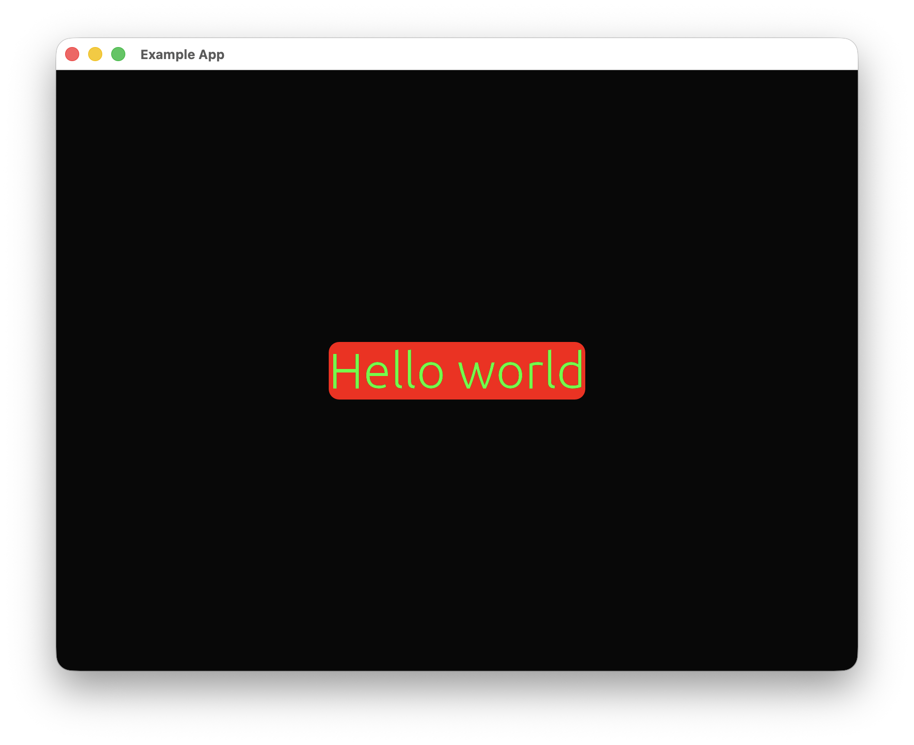

基本前端资源普遍比较简单，也能充分发挥`Rust Constructor`的力量。

# 图片

`Image`可以用于显示图片，并添加各类叠加层。

## 代码示例

我们以加载`Rust Constructor`的图标作为示例：


```rust
self.inner
    .quick_place(
        "Example",
        rust_constructor::basic_front::Image::default()
            .basic_front_resource_config(
                &rust_constructor::BasicFrontResourceConfig::default()
                    .position_size_config(
                        rust_constructor::PositionSizeConfig::default()
                            .origin_size(300_f32, 300_f32)
                            .x_location_grid(1_f32, 2_f32)
                            .y_location_grid(1_f32, 2_f32)
                            .display_method(
                                rust_constructor::HorizontalAlign::Center,
                                rust_constructor::VerticalAlign::Center,
                            ),
                    ),
            )
            .image_load_method(
                &rust_constructor::basic_front::ImageLoadMethod::ByPath((
                    "logo.png".to_string(),
                    [false, false],
                )),
            ),
        None,
        ui,
    )
    .unwrap();
```
这里展示了一个完整的调用资源过程。其中，`basic_front_resource_config`是每一个基本前端资源拥有的字段，里面包含`PositionSizeConfig`，是一个用于控制资源显示位置，大小，对齐方式等内容的结构体。这段代码中，`origin_size`用于控制图片大小，`x_location_grid`和`y_location_grid`都是网格式定位，具体来说，就是把宽度或高度除以第二个数字再乘第一个数字得到定位。在这段代码中，我们将其定位在窗口中心。`display_method`用于控制横竖两个方向上坐标对应的位置，默认为图片左上角，在这里我们手动配置为了图片正中央。

`image_load_method`拥有加载路径和加载纹理两种模式，底部的两个布尔值分别控制是否要进行水平和竖直翻转。

运行效果大致如下：


在较新版本的`Rust Constructor`中，图片的加载是基于多线程的，所以如果加载的图片尺寸较大，你可能需要等一段时间才能在页面上看到你的图片被加载出来。

# 文本

`Text`可以用于显示一些文本，同时支持一些文本操作。

## 代码示例

```rust
self.inner
    .quick_place(
        "Example",
        rust_constructor::basic_front::Text::default()
            .basic_front_resource_config(
                &rust_constructor::BasicFrontResourceConfig::default()
                    .position_size_config(
                        rust_constructor::PositionSizeConfig::default()
                            .origin_size(300_f32, 100_f32)
                            .x_location_grid(1_f32, 2_f32)
                            .y_location_grid(1_f32, 2_f32)
                            .display_method(
                                rust_constructor::HorizontalAlign::Center,
                                rust_constructor::VerticalAlign::Center,
                            ),
                    ),
            )
            .content("Hello world")
            .background_rounding(10_f32)
            .background_color(255, 0, 0)
            .background_alpha(255)
            .font_size(50_f32)
            .color(0, 255, 0),
        None,
        ui,
    )
    .unwrap();
```

运行效果大致如下：



# 自定义矩形

`CustomRect`可以以`Rust Constructor`的形式创建一个可高度自定义的矩形。

## 代码示例

```rust
self.inner
    .quick_place(
        "Example",
        rust_constructor::basic_front::CustomRect::default()
            .basic_front_resource_config(
                &rust_constructor::BasicFrontResourceConfig::default()
                    .position_size_config(
                        rust_constructor::PositionSizeConfig::default()
                            .origin_size(300_f32, 300_f32)
                            .x_location_grid(1_f32, 2_f32)
                            .y_location_grid(1_f32, 2_f32)
                            .display_method(
                                rust_constructor::HorizontalAlign::Center,
                                rust_constructor::VerticalAlign::Center,
                            ),
                    ),
            )
            .border_width(5_f32)
            .border_color(0, 0, 255)
            .rounding(5_f32)
            .color(0, 255, 0),
        None,
        ui,
    )
    .unwrap();
```

运行效果大致如下：


